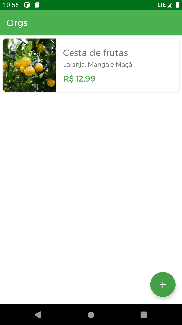

## Funcionalidades do projeto

O App lista produtos com imagem, título, descrição e valor. Também, é possível cadastrar produtos. Todo armazenamento é mantido em memória do App, portanto, ao finalizar o App as informações são perdidas.

### Técnicas e tecnologias utilizadas

As técnicas e tecnologias utilizadas pra isso são:

- CardView: container para apresentar cada produto na lista de produtos
- RecyclerView: listagem das produtos
- ConstraintLayout: ViewGroup padrão para implementar todos os layouts
- ImageView: View para apresentar imagens no App
- Coil: carregar imagens via requisição HTTP
- View Binding: busca de views do layout de forma segura
- AlertDialog: Exibição de formulário para carregar novas imagens do produto
- Fontes personalizadas: configuração para adicionar novas fontes
- Extension functions: adicionar comportamentos em outras classes para reutilizá-los
- Personalização de tema: modificação de cores para o tema do App

## Acesso ao projeto

Você pode [acessar o código fonte do projeto inicial](https://github.com/alura-cursos/android-com-kotlin-personalizando-ui/tree/projeto-inicial) ou [baixá-lo](https://github.com/alura-cursos/android-com-kotlin-personalizando-ui/archive/refs/heads/projeto-inicial.zip).
